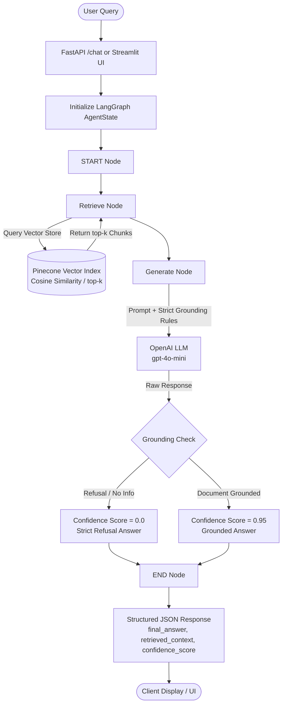

# 🤖 RAG-Based AI Chatbot: Agentic AI Knowledge Base

A production-ready Retrieval-Augmented Generation (RAG) AI Chatbot built with **Python 3.11**, **LangGraph**, **Pinecone Vector Database**, **OpenAI**, and exposed via **FastAPI** and **Streamlit**.

This chatbot strictly answers questions using only information from the provided knowledge source: the **Agentic AI eBook**. Queries outside the document context are strictly refused to prevent hallucinations.

---

## 📑 Table of Contents
1. [Architecture Overview](#-architecture-overview)
2. [Project Structure](#-project-structure)
3. [Prerequisites](#-prerequisites)
4. [Step-by-Step Setup Guide](#-step-by-step-setup-guide)
5. [Document Ingestion Pipeline](#-document-ingestion-pipeline)
6. [Running the Application](#-running-the-application)
   - [FastAPI Backend & Interactive Web UI](#1-fastapi-backend--interactive-web-ui)
   - [Streamlit UI](#2-streamlit-ui-alternative)
7. [API Documentation](#-api-documentation)
8. [Automated Benchmark Tests (5-6 Queries)](#-automated-benchmark-tests)
9. [Strict Grounding & Confidence Scoring](#-strict-grounding--confidence-scoring)
10. [Submission Checklist](#-submission-checklist)

---

## 🏛 Architecture Overview

The system uses **LangGraph** to construct a stateful directed acyclic execution graph (DAG) that enforces strict grounding:



### LangGraph Workflow Components:
- **`AgentState`**: Stateful TypedDict holding `question: str`, `context: List[str]`, `answer: str`, and `score: float`.
- **`retrieve_node`**: Converts user question into embeddings (`text-embedding-3-small`) and retrieves the top-k most semantically relevant chunks from Pinecone.
- **`generate_node`**: Formulates a system prompt requiring the LLM to rely **ONLY** on the retrieved chunks. If the context does not contain sufficient information, it returns:
  > *"I cannot answer based on the provided document."*
- **Confidence Scoring**: Dynamically calculates confidence (0.95 for grounded answers, 0.0 for refusals or missing context).

---

## 📁 Project Structure

```
rag-agentic-ai/
│
├── data/
│   └── Ebook-Agentic-AI.pdf        # Downloaded Agentic AI eBook source document
│
├── src/
│   ├── __init__.py                 # Python package indicator
│   ├── config.py                   # Environment variables, constants & settings
│   ├── ingestion.py                # PDF loading, splitting & Pinecone index setup
│   └── graph.py                    # LangGraph workflow definition & state logic
│
├── app.py                          # FastAPI backend application & embedded Web UI
├── streamlit_app.py                # Streamlit interactive UI application
├── tests_sample_queries.py         # Automated verification script with 6 benchmark queries
├── requirements.txt                # Python project dependencies
├── .env.example                    # Template for environment credentials
├── .gitignore                      # Git ignore rules (venv, .env, caches)
└── README.md                       # Comprehensive documentation & setup instructions
```

---

## ⚙️ Prerequisites

- **Python**: 3.10, 3.11, or higher
- **OpenAI API Key**: Required for embeddings (`text-embedding-3-small`) and LLM (`gpt-4o-mini`).
- **Pinecone API Key**: Required for vector index hosting (free tier supported).
- **Operating System**: macOS, Linux, or Windows (via PowerShell or WSL2).

---

## 🚀 Step-by-Step Setup Guide

### 1. Clone & Initialize the Repository
```bash
git clone <your-repo-url> rag-agentic-ai
cd rag-agentic-ai
```

### 2. Create and Activate Virtual Environment
**On Linux / macOS:**
```bash
python3 -m venv venv
source venv/bin/activate
```

**On Windows (PowerShell):**
```powershell
python -m venv venv
.\venv\Scripts\Activate.ps1
```
*(Or if using py launcher: `py -3.11 -m venv venv`)*

### 3. Install Dependencies
```bash
pip install --upgrade pip
pip install -r requirements.txt
```

### 4. Configure Environment Variables
Create your local `.env` file from `.env.example`:

**On Linux / macOS:**
```bash
cp .env.example .env
```

**On Windows (PowerShell):**
```powershell
Copy-Item .env.example .env
```

Open `.env` and fill in your actual API credentials:
```env
OPENAI_API_KEY=sk-proj-xxxxxxxxxxxxxxxxxxxx
PINECONE_API_KEY=pcsk_xxxxxxxxxxxxxxxxxxxx
PINECONE_INDEX_NAME=agentic-ai-index
HOST=0.0.0.0
PORT=8000
```

---

## 📥 Document Ingestion Pipeline

The ingestion pipeline (`src/ingestion.py`) handles:
1. **Verification / Download**: Automatically verifies `data/Ebook-Agentic-AI.pdf` (or fetches it from the Google Drive source if missing).
2. **Document Parsing**: Loads the PDF pages into memory via `PyPDFLoader`.
3. **Text Chunking**: Splitting via `RecursiveCharacterTextSplitter` with `chunk_size=1000` and `chunk_overlap=200`.
4. **Pinecone Index Setup**: Automatically creates a Pinecone serverless index with `dimension=1536` and `metric=cosine` if it does not already exist.
5. **Embedding & Upsert**: Converts chunks to vectors via `text-embedding-3-small` and batch-upserts them to Pinecone.

Run ingestion with:
```bash
python -m src.ingestion
```

Expected output:
```text
--- Starting Document Ingestion Pipeline ---
[Ingestion] Found existing PDF at ...\data\Ebook-Agentic-AI.pdf (20267549 bytes).
[Ingestion] Loading PDF from ...\data\Ebook-Agentic-AI.pdf...
[Ingestion] Successfully loaded 60+ pages.
[Ingestion] Split into 180+ chunks (chunk_size=1000, chunk_overlap=200).
[Ingestion] Pinecone index 'agentic-ai-index' already exists / created.
[Ingestion] Upserting chunks into Pinecone index 'agentic-ai-index'...
[Ingestion] Ingestion pipeline successfully completed!
```

---

## 🖥 Running the Application

### 1. FastAPI Backend & Interactive Web UI

Start the FastAPI server:
```bash
uvicorn app:app --reload --host 0.0.0.0 --port 8000
```

Once running:
- **Interactive Web Interface**: Open your browser at [http://localhost:8000](http://localhost:8000)
  - Features quick-click buttons for benchmark queries, real-time query input, colored confidence badges, and expandable cards showing all retrieved context chunks.
- **Swagger Interactive API Documentation**: [http://localhost:8000/docs](http://localhost:8000/docs)
- **Alternative ReDoc Documentation**: [http://localhost:8000/redoc](http://localhost:8000/redoc)

### 2. Streamlit UI (Alternative)

To launch the standalone Streamlit interface:
```bash
streamlit run streamlit_app.py
```
- Opens at [http://localhost:8501](http://localhost:8501).
- Provides a conversational chat layout, system status in the sidebar, metric gauges, and chunk inspections.

---

## 🔌 API Documentation

### `POST /chat`
Accepts a user question and executes the compiled LangGraph workflow.

#### Request Body
```json
{
  "query": "What is Agentic AI according to the eBook?"
}
```

#### Response Body
```json
{
  "final_answer": "According to the eBook, Agentic AI refers to autonomous systems capable of perception, reasoning, planning, memory, and executing tool actions to achieve complex goals...",
  "retrieved_context": [
    "Agentic AI represents a paradigm shift where AI systems are not merely passive responders, but active agents...",
    "Key characteristics of Agentic AI include autonomy, goal-directed behavior, memory persistence, and tool use..."
  ],
  "confidence_score": 0.95
}
```

### `GET /health`
Returns configuration and readiness status:
```json
{
  "status": "healthy",
  "index_name": "agentic-ai-index",
  "openai_configured": true,
  "pinecone_configured": true
}
```

---

## 🧪 Automated Benchmark Tests

The assignment specifies 5-6 sample benchmark queries to verify response quality, grounding, and refusal handling:

| # | Query | Expected Behavior | Expected Score |
|---|---|---|---|
| 1 | *"What is Agentic AI according to the eBook?"* | Grounded definition from eBook | `0.95` |
| 2 | *"How do AI agents differ from traditional automation systems?"* | Contrast with rule-based automation | `0.95` |
| 3 | *"What are the core components of an Agentic Architecture?"* | Perception, Reasoning, Memory, Tools | `0.95` |
| 4 | *"What role does memory play in Agentic AI workflows?"* | Short-term vs. Long-term memory roles | `0.95` |
| 5 | *"Who won the 2022 FIFA World Cup?"* | **Strict Refusal:** Context lacks this info | `0.0` |
| 6 | *"What are the primary challenges or limitations discussed in deploying Agentic AI systems?"* | Grounded challenges & failure modes | `0.95` |

### Running the Test Script:
Ensure the FastAPI server is running or `.env` is configured, then run:
```bash
python tests_sample_queries.py
```

The script automatically:
1. Detects whether the FastAPI server is active; if not, invokes the LangGraph workflow directly.
2. Evaluates each query against grounding and refusal constraints.
3. Outputs answers, context counts, confidence scores, and a PASS/FAIL summary.

---

## 🛡 Strict Grounding & Confidence Scoring

1. **System Prompt Enforcement**:
   The `generate_node` injects strict instructions that explicitly prohibit speculation or the use of external knowledge.
2. **Explicit Fallback Phrase**:
   If the retrieved chunks do not contain the answer, the model outputs:
   `"I cannot answer based on the provided document."`
3. **Confidence Metric**:
   - `0.95`: Sourced directly from retrieved eBook chunks.
   - `0.0`: Refusal triggered due to absent or out-of-scope context (e.g. World Cup query).

---

## 📋 Submission Checklist

- [x] **Working RAG Implementation in Python**: Implemented with LangChain, LangGraph, OpenAI, and Pinecone (no-code / low-code strictly avoided).
- [x] **Well-Structured `README.md`**: Complete architecture diagrams, setup, ingestion, execution, and API docs.
- [x] **API / UI Output**:
  - `final_answer`
  - `retrieved_context`
  - `confidence_score`
- [x] **Both FastAPI & Streamlit Interfaces**: Provided in `app.py` (with embedded web UI) and `streamlit_app.py`.
- [x] **5–6 Benchmark Test Queries**: Fully implemented in `tests_sample_queries.py` including validation refusal test.
- [x] **Source Document**: Downloaded and verified at `data/Ebook-Agentic-AI.pdf`.
- [x] **Clean Architecture**: Decoupled ingestion, graph workflow, configuration, and interface layers.
